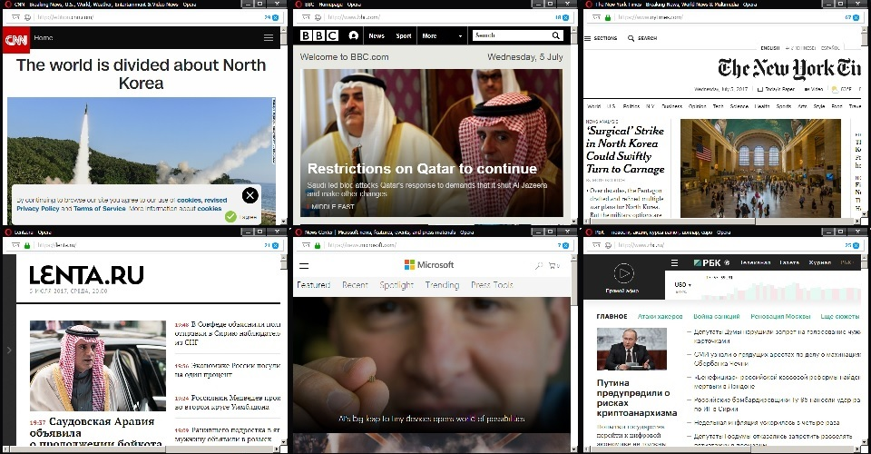

# MicroMonitoring2 (ver.2)
	
	Unlimited sites. Http and https. All in one file. No install. Absolutely free.

Upgrade to ver.2 because of <a title="CORS - Cross Origin Resource Sharing" href="https://developer.mozilla.org/en-US/docs/Glossary/CORS">CORS</a>,

https://developer.mozilla.org/en-US/docs/Glossary/CORS

https://en.wikipedia.org/wiki/Cross-origin_resource_sharing

monitored sites will be open in separate window.

If monitored site is not use Cross origin policy, you can use iframe <a href=https://github.com/e-x/MicroMonitoring>version</a> !

[ EN ]
	- MicroMonitoring
	
	Refresh every 300 sec(5 min). For change - update "interval" in code.

	sys – Array of the names and URLs of monitoring systems
	name – Name of URLs (just for convenience)
	url - URL of watched system

[ RU ]
	- МикроМониторинг
	
	Обновляется раз в 300 секунд (5мин) для правки использовать "interval" в коде.

	sys – массив имён/урл-ов каждой системы
	name – имя урла (не используется, только для удобства)
	url - урл мониторимой системы
	
 

  

